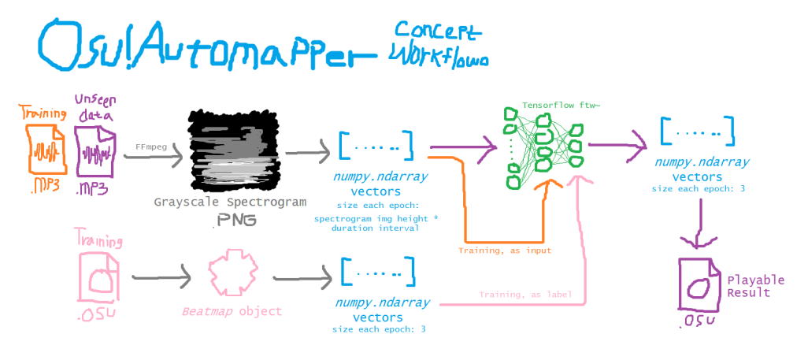

<style><!--If you can see this HTML comment in the rendered page, it means, you're probably seeing this file in GitHub. GitHub does not like the user to style their markdown file because it means it enables user to override with their style and probably doing javascript injection through that. I advise to use your markdown renderer, like Visual Studio Code by pressing CTRL+K V

I'm using inline style HTML on markdown for, obviously, styling purposes.--></style>

# **_Expert Systems 112 Portfolio Assignment_**

1313617014<br/>
2017 Computer Science of Jakarta State University<br/>
Muhammad Aufi Rayesa Frandhana<br/>
me@maufirf.me (business)<br/>
AufiRayesa_ilkom17@mahasiswa.unj.ac.id (academic)

---------------
---------------

## **DISCLAIMER**

I have a few many projects for the last 6 months back, however, some of them are mostly private and/or not hosted at github, in which I cannot allow any third parties to observe at it. All the code written on my github were originally written by me or said otherwise. When I took reference from other sites (i.e StackOverflow), I usually put comments on the code. I can't really document them because I wrote too much lines. The dependencies are mostly written by the third parites (i.e NumPy, Discord.py) unless stated otherwise. Almost none of them have proper license yet because the platforms I'm deploying does not require that necessarily and Indonesian goverment has no regulation on that yet. I don't have a privacy policy yet regarding data collection from the users for some of my projects, but most of them came from Google Forms which require them to log in and consent to send data under Google's privacy policy, at least to this date.

This repository does not include the source code as the source codes are already put in their own repository and re-cloning it is futile.

---------------
---------------

# Section 1: Programming Projects

## Overview

### Status of the projects

On this portfolio assignment, I will feature six public project instances. Although, I can't provide all the link to the deployment site and/or the repository site. Each project will be marked with appropriate development status flair and content safety flair.

1. [KRSBot5000](#KRSbot5000) **\[<a style="color:green">Deployed, Online</a>\]** ([Github Repo](https://github.com/parampaa2/krsbot5000))
2. [Bottlebot1904](#Bottlebot1904) **\[<a style="color:green">Deployed, Online</a>\]** ([Github Repo](https://github.com/parampaa2/bottlebot1904) | [Facebook Deployment](https://fb.me/bottlebot1904) | [Twitter Deployment](https://twitter.com/bottlebot1904))
3. [Bot](#Bot) **\[<a style="color:darkgreen">Deployment Paused</a>\]** ([Github Repo](https://github.com/parampaa2/bot) | [Facebook Deployment](https://fb.me/reallyabot) | [Twitter Deployment](https://twitter.com/really_a_bot) || **<a style="color:orange">\[POTENTIAL NSFW\]</a>**)
4. [Osu!AImapper](#Osu!AImapper) **\[<a style="color:pink">Development Paused</a>\]** ([Github Repo](https://github.com/parampaa2/Osu-AImapper))
5. [Bot tutorial (Indonesian)](#Bot_tutorial_(indonesian)) **\[<a style="color:yellow">In development</a>\]** ([Github Pages](http://maufirf.me/python-bot-quick-guide-id/) || **<a style="color:red">\[NSFW\]</a>**)
6. [Twitterfessbot](#Twitterfessbot) **\[<a style="color:green">Deployed, Online</a>\]** ([Facebook Deployment](https://fb.me/twitterfessbot) || **<a style="color:orange">\[POTENTIAL NSFW\]</a>**)

Development status flair meaning:

- **\[<a style="color:green">Deployed, Online</a>\]** means the project is **done** and **currently active for user**
- **\[<a style="color:darkgreen">Deployment Paused</a>\]** means the project is **done** and at least **deployed once**, but under a certain situation, the current state of deployment has to be paused.
- **\[<a style="color:yellow">In development</a>\]** means the project is **being actively developed**.
- **\[<a style="color:pink">Development Paused</a>\]** means the project is **being developed**, but under a certain situation, the current state of development has to be paused.

Content safety flair meaning (_Note: User comments on the project deployment site may may vary on the scale of the safetiness_):

- _no tags_, it means it is safe for normal viewing in public.
- **<a style="color:red">\[NSFW\]</a>** means it is guaranteed to has **at least one** deliberate content that is not safe to view at public, or may cross out your morality guidelines. View at your own discretion. This includes but not limited to:
    - Gore, blood, sadism
    - Adult references, fetishes
    - Politics, religion
    - Racial references
    - Locally-subjective controversial opinion
    - Curses, anger expression
    - Mentally challenging (i.e suicidal in nature, or psychological disorders)
    - Insensitive materials
    - Potential terrorism act
- **<a style="color:orange">\[POTENTIAL NSFW\]</a>** is just like NSFW, but said content are not meant to be there, and its existence are heavily affected due to the nature of user input from internet directly to the project system. Active countermeasure is being rolled out like filtering and manual screening of content. View at your own discretion.

### Nature of the projects

Most of the featured projects are fun projects, and mostly have public entertainment purposes. The highest amount of projects in one category goes to the bot projects. I often experiment with social media bots. Until today, I have deployed four bots (one of them is offline), two bots being privately developed, and one bot plan. It is becoming like an hobby for now. I am heavily influenced by the community I have. It is also ws kind of achievement for myself. I got a lot of social connections from the community I've often hang out with. They are [The Bot Appreciation Society (BAS)](https://botappreciationsociety.github.io/), they are collective who likes to enjoy the contents of or make social media entertainment bots. I am also registered as official botmin (bot admin), which is I consider as big achievement.


_<sup>My admin bot list slot on the community Discord server</sup>_

I also received money as donations by fans. It's not much, but it was really remarkable for me to actually get money from something I love for the first time. I also made friends with international people. Most of my friends came from South America, specifically Argentina. They helped me through my real life situations despite the distance separating us.

I gave my bots a short introduction on a dedicated page: [maufirf.me/Botttlemin-Bots](http://maufirf.me/Bottlemin-Bots), in which I took the description and copy-pasted it here. Our bots mostly do one thing in common:

_Posting random stuff_

How is it funny and entertaining? I think [this prediction of future from 17 years ago can explain it better](https://www.youtube.com/watch?v=j4Ph02gzqmY), _"It's funny because it's unexpected"_.

<iframe width="560" height="315" src="https://www.youtube.com/embed/j4Ph02gzqmY" frameborder="0" allow="accelerometer; autoplay; encrypted-media; gyroscope; picture-in-picture" allowfullscreen></iframe>

Most of the bots is open source, and all you had to do is fork it, filling up the paperwork on the social media platform you wanted to deploy on, complete dependenceies, replace access tokens, and then as simple as running
```bash
$ python bot.py
```
Detailed information is on each of the bots' `README.md`.

## Projects

### KRSBot5000


_<sup>KRSBot5000 on action</sup>_

**KRSBot5000** is a Discord bot that is capable to generate random mix of student study plan. The basic individual random recipe follows this structure:

- University name. Mostly came from Indonesia, but will eventually go larger and wider as the database grows
- Faculty name. Ditto.
- Major name. Ditto.
- Semester number, randomized between 1-8 inclusive.
- Lists of courses with their associated number of credit weight.
- Available credits for current semester, randomized from the choice of 18, 20, 22, and 24
- Used credits

The only purpose is to generate random KRS. The target user of this bots are the servers that wants to have automated entertainment content.

The development of this bot starts around November 26th, 2018. It is working on the offline part, but not yet ready to be used for online purposes to that date. Instead, It's deployed on May 25th, 2019. To this day, I'm aware this bot is used on at least three Discord servers.

This bot was made as inside joke originated from [BEM Shitposting Indonesia (BEMSHI)](https://web.facebook.com/bemshitposting/) community, which consisted of people that revolves around Facebook pages of each universities' shitposting representatives. Prior to the deployment date, this bot has no affiliation with previously said group, BAS.

So far, the database (which is lazily stored in JSON) has almost complete courses data from these majors:

- Ilkom UNJ
- SBM ITB
- Desain Interior Telkom University
- Sastra Jepang UNAIR

There's not much dependencies used for this bot as this bot only uses [Discord.py](https://discordpy.readthedocs.io/en/latest/) as the API wrapper for Discord. The code are original.

### Bottlebot1904


_<sup>The swan bottle from Bottlebot1904</sup>_

_copied from [maufirf.me/Bottlemin-Bots](http://maufirf.me/Bottlemin-Bots):_
> BottleBot1904 is my first bot (though not very first. it’s just the first one being published globally). What it does is basically gather all images of bottles in the database, slicing every bottle into pieces, and make a Frankenstein’s bottle using those pieces randomly, and named randomly. It posts every hour.

This is the largest installment of bot I ever had both on Twitter and Facebook. Under the first 24 hours of deployment on November 3, 2019, the bot already gained 200 likes on Facebook. On December 20, 2019, the bot reaches 1K likes. By the time this is being written, the bot already gained 2500 likes.

The development of this bot is surprisingly fast and fascinating. This was born in one of the computer lab in Jakarta State University two day prior to deployment. It was later perfected at home. The general audiences are just generic users who wants to find the automated self-refreshing entertainment content. Through the dates, I've come up with updates, sorted from the first release:

1. Bot deployment
2. Added wide variety of bottles and consistent canvas size (1000x1000px)
3. Added bottle parts information and randomized names
4. Added randomized volume amount and units

Currently, the bot is now having the biggest update it will ever receive: an interactive website where people can submit their own bottles, generate their own bottle, or use an API to receive generated bottle on their programs or apps. It is not on this project, since the bot and site runs on different codebase.

The bot codebase is on Python 3.7 and uses PIL for Image processing, Numpy for image editing, Facebook-SDK as Facebook Graph API wrapper, and Tweepy as Twitter API Wrapper. The code is undeniably original.

### Bot


_<sup>I have to be honest I cannot really explain what the bot is doing, but the vagueness is its selling point.</sup>_

_copied from [maufirf.me/Bottlemin-Bots](http://maufirf.me/Bottlemin-Bots):_
> The main inspiration of Bot is the Facebook page [THEY](https://www.facebook.com/profile.php?id=1149863928385827&ref=br_rs) and its group ([THEY (how do i tag myself?)](https://www.facebook.com/groups/theytheytheytheythey/)) for their vaguely meta contents. The motivation that pushes this bot to its existence is the running joke of _[some of the facebook 'bots' is actually not bots](https://www.facebook.com/groups/botappreciationsociety/permalink/533509313925543/)_ in [Bot Appreciation Society Facebook group](https://www.facebook.com/groups/botappreciationsociety). Since the ban of two Facebook pages that were pretending to be bots, people just raise suspicion whether any bots are actually bots or otherwise ironically. So, this more like a sarcastic bot that is pretending so hard being a bot by simply being an actual bot. If you tried to indulge the contents unironically, what you find is just a bot that posts incomplete sentences following a series of patterns.
>
>Seriously, if you thought Bot is not a bot, _[you're right.](https://github.com/parampaa2/bot)_

As described above, I cannot clearly explain what the bot does on its posts. However, on the technical terms, the bot basically just chooses random patterns of words and replaces placeholders on selected patterns with randomly selected words. I have set a few patterns that can be combined, so there is virutally limitless amount of sentences that can be made. That means the bot can just write a sentence that is as long as [the Library of Babel](https://libraryofbabel.info/). To eliminate that possibility while still allowing the bot to write long sentences, I give the patterns weight, so the patterns that will most likely to extend sentences will less likely to be chosen.

The bot posseses six sentence-closing patterns, eleven linear sentence-expanding patterns, and four exponential sentence-expanding patterns.

This bot only took just an hour of development. The Facebook page was born on 25th February, 2020, but it was actually deployed two days later. Within five days, the page has gained 1000 likes. Currently, it has 2000 likes.

Bot is the first of my bots to gain user input through automated means. Previously, I added data to database manually. But now, I am using Google Forms and Google Docs + Drive API to obtain those input and actually using it without my direct involvement. However, there's a hard truth I have to learn - _moderate your user input_:


_<sup>The one and only blunder I swear that will ever happen</sup>_

I was shocked that my bot posted a sentence with a hard-r n-word, which is a racial slur that Facebook recognizes and will likely to banish the page to the void with nothing left to recover. This was happened because when the bot chooses the "choose one of the user input words" pattern by chance, the bot happened to choose that racial slur made by our naughty users. It has been a long running gag between our community that if a bot posts that racial slur, they will pay a grave mourning visit to the page as if the page is as good as dead.

There were five people messaging me about the post when the racial slur post was published to make sure I do quick action to secure my page. However, I have a different thinking - _what if i just let it be to test out if Zucc* is still being an insensitive jackass?_ Well, to my 24 hour observation, I still don't get a ban. But I was so anxious that I finally do something about it: edit the post and gave a disclaimer about the event.

_<sup>*) Zucc is the pejorative nickname the internet gave to Mark Zuckerberg. This also happen as a verb: "To suppress a facebook user or their assets in facebook with usual means, including but not limited to: banning, unpublishing, force deletion".</sup>_

I got a whole-month ban three days after the tragedy. Not just the page, my personal account was also affected and I cannot use Facebook at all. Right now, i got the access to the bot back, but I hadn't implemented the user input filtering feature yet so I don't have a gut to run it back.

### Osu!AImapper


_<sup>Osu!AImapper logo</sup>_

_Copied from [github.com/parampaa2/Osu-AImapper](https://github.com/parampaa2/Osu-AImapper):_

> Produces an Osu!Standard beatmap from a given track of song, the style of mapping is based on the given beatmap (that is already made) using Artificial Intelligence.
>
> 
>
> Currently this is still in development and I'm personally still learning about Artificial Intelligence. Despite the Artificial Intelligence Introduction course i went through last semester, i don't think my knowledge is sufficient enough for this, that's why i'll keep learning albeit just by myself.
>
> I'm not really thinking to open the development to public for now, but if you're interested to be involved, come and hang out to my Discord server and let's talk about that. Check the [most recent Osu! forum thread for Osu!Automapper](https://osu.ppy.sh/community/forums/topics/872388), which is very old lmao.
>
> NOTE: I'm in hiatus developing this for undetermined duration. My mental state is really not okay to keep continuing my hobby projects while also doing college stuff and working. Thanks for understanding!

This is the second most ambitious and largest in scale solo project I ever started. The premise behind this project was I was too bored completing all my favorite maps from my favorite mapper in [Osu!](https://osu.ppy.sh). I have several songs that I really want to play. The catch was it was either made by other people than my favorite mapper, or it's just not there at all. Every single mappers on Osu! community has their own unique perks, that is what differs them from each other. _What if there is a way to reproduce the style of a mapper to a new song?_

The program will first read the song as an image by converting the song into grayscale spectrogram on a fixed height dimension (default is 128 pixel) and width following the song duration down to one milisecond in accuracy (1ms:1px) image using [FFMPEG](https://ffmpeg.org), then the processed with PIL to make it readable in python. After the image is read, it is converted into numpy array, padded and separated into sliding windows which width has same value as the amount of the input nodes in the neural network that is associated to music nodes, or multiplies of them according to the context variable value that will be decided later. My decision to convert it to spectrograph was to reduce the data needed to be processed, because a good song will have a really high sample points, averaging at 48000hz. Therefore by reducing it into 1000hz is clearly better, with the tradeoff on the song fidelity. I was assisted by [Cary Huang](https://twitter.com/realCarykh) on this problem. He is a computer science student who excels in artificial intelligence, he also have his own [youtube channel](https://www.youtube.com/user/carykh).


_<sup>Cary Huang assisting me on Twitter</sup>_

The map file will also be read. There is a [framework](https://github.com/ppy/osu-framework) that can help me read the .OSU file format made by Osu!Dev, unfortunately it is in C# and I don't want to fuss a lot about that. So I made my own framework in python. I didn't separate it into different project because my framework usage isn't as intense as the original framework - I only wanted to use it to read basic objects and settings. The .OSU file format was pretty readable, and [the docs](https://osu.ppy.sh/help/wiki/osu!_File_Formats/Osu_(file_format)) was clear enough for me to do it by myself. Since the map is also detailed down to a milisecond, it is already a match with the song data. I will just have to convert it into a numpy array too, matching its width dimension like the audio data. The height however, will be fixed into three rows. This is because out of four hit objects in Osu!, I will only need the first three (Circles, Sliders, Spinners), because the last one (Osu!Mania hold) is preserved for other gamemode which I won't need. That means there will be three nodes that is associated for the map data, or multiple of them also according to the context variable value that will be decided later. However, i don't really need context for this because it will be on output layer. It's an integral data, and not a differential data.

Song, or generally audio, is something we hear because there is a differential between sample points. We cannot hear a sound if there is only one sample point, it's different from reading a single visual datum and we still understand that. Therefore, we needed context. I have mentioned the context variable value, that will determine how much context we need. A context is defined by how many miliseconds to the past and to future of a sliding window with current time datum on the center of sliding window

I haven't yet completed the architecture of the neural networks to fit my needs. My knowledge, experiments, and time isn't enough just yet. My computer was broken too, so I cannot really do experiments. I even had to code at internet cafes, or going to university lab which is totally unreliable. This is one of the physical reason I put the development into pause.

By training the AI with the training song and match it with the training map, I will then be able to use another song to test or produce a beatmap. However, the assessment for resulting test or production map will be hard as it has to be manually reviewed. The cost function will be modified to receive my manual user input between 0 and 1 as whether the map is close enough to the mapper style or not. This still can be changed later though. The resulting data generated from the neural net is still on numpy array, but it can be easily re-converted to the .OSU format.

This project was also influenced by my favorite math youtuber, [3Blue1Brown](https://www.youtube.com/channel/UCYO_jab_esuFRV4b17AJtAw). His explanation in animated math really helped me through some of our courses in college, especially calculus and neural networks.

I was having a pretty much hard time, but I have a huge support from the community. My github repository has 5 stars, even though it isn't finished yet. I also received some artworks for my project's mascot: Aima.


_<sup>Osu!AImapper mascot illustration made by several artists. The first one is made by Adi, the last two are made by Vyrde.</sup>_

It isn't finished yet, and the tinkering is still done in-interpreter, mainly using iPython. So it is still not user friendly at all. However, I am planning to use tkinter to make the cross-platform GUI for this project.

The project was first committed on February 17th, 2019. The project was continued offline. However, there was a really bumming accident where my laptop is completely dead and I have no computers at all to continue. The data was lost, the offline commits that hadn't yet been pushed online to remote repo is also gone. Later on the middle of 2019, I decided to pause the development indefinitely.

### Bot tutorial (Indonesian)


_<sup>Indonesian python quick bot guide i made on github pages, complete with example boilerplates. I hadn't complete the project overall though.</sup>_

This is a solo community project I aim for Indonesian audiences that is wanted to started to learn how to make social media bots. My tutorial covers for the three mainstream platforms: Facebook, Twitter, and Discord. This is hosted in github pages. Thus, there's no other dependencies other than Jekyll, which is being resolved automatically by github. I really put hopes that this project will help Indonesian beginner programmers to start doing something with it, either for their hobbies or actually their careers and business.

The background of this project was the lack of clear and thorough tutorials of the subject in the internet. In the contrast, there is a whole lot more than just sufficient amount of resources and helping communities in english. There are some tutorials too, but most of them involves using ready-to-use GUI web-based API and no programming needed. I'm not targeting just for the people to be able to make bots, I am aiming to give them a full freedom (and responsibilities) in developing their own bot.

In fact, one of the the bot i made that I will explain after this uses the boilerplate code i made for this tutorial as a proof of concept. It has only a few lines of codes, which I hope will less discouraging the readers, and instead motivates them to make one because it is not that hard. It is hard, of course, but it's not like people are going to die making this harmless bots.

This project took awhile, I started writing for two days and then i paused when reaching the checkpoint. I am still continuing to writing it, but I need a computer replacement first, because I'm not doing it again in internet cafe amidst the pandemic.

This early developed tutorial has been used by some people, including one of our colleagues in UNJ. This tutorial (to the current state) has been proofread by several people too.

### Twitterfessbot


_<sup>Twitterfessbot sample post</sup>_

_Copied from Twitterfessbot `README.md`:_

> # Twitterfessbot42069
>
>Twitterfessbot, or TFB for short, is a [Facebook bot](https://fb.me/twitterfessbot) that posts random tweets from randomly selected anonymous confession accounts that is generally localized to Indonesian region. Born May 12th, 2020, amidst the COVID-19 pandemic in a ominous chat group. The bot was a mere joke to the "bot idea" meme which flourishes on [The Bot Appreciation Society](https://web.facebook.com/groups/botappreciationsociety), and also a satire to those fess accounts. This bot is under the supervision of [Bottlemin](https://maufirf.me/Bottlemin-Bots).
>
>## Fess accounts
>
>Fess accounts are anonymous confession accounts that receives DMs from twitter users and repost the message as anonymous tweet in its timeline. These accounts often known as proxy accounts where it's ownership (fully or partially) belongs to a community to post from multiple personal identity as one identity. Nobody knows who tweets what (unless they leak themselves, which they ALWAYS do and defeats its purpose.) This bot feeds on the some fess accounts. In current build, the bot hardcodes the accounts to be fetched. Supported accounts (You can always edit it in `accounts.json`):
>
>- [@collegemenfess](https://twitter.com/collegemenfess)
>- [@memefess](https://twitter.com/memefess)
>- [@WEBTOONFESS](https://twitter.com/WEBTOONFESS)
>- [@schfess](https://twitter.com/schfess)
>- [@squidwardfess](https://twitter.com/squidwardfess)
>- [@starfess](https://twitter.com/starfess)
>- [@Asknonym](https://twitter.com/Asknonym)
>- [@souhitmenfess](https://twitter.com/souhitmenfess)
>- [@donaldfess](https://twitter.com/donaldfess)
>- [@bacotfess](https://twitter.com/bacotfess)
>- [@menfesssyg](https://twitter.com/menfesssyg)
>- [@fess_yeah](https://twitter.com/fess_yeah)
>- [@jejepanganfess](https://twitter.com/jejepanganfess)
>- [@SpongebobFess](https://twitter.com/SpongebobFess)
>- [@tubirfess](https://twitter.com/tubirfess)
>- [@GamesMenfess](https://twitter.com/GamesMenfess)
>- [@MUSIC_FESS](https://twitter.com/MUSIC_FESS)
>
>## Deployment
>
>here are some Python dependencies you have to resolve. It is listed on `requirements.txt`, but I'll just rewrite them all here:
>
>- [tweepy](https://www.tweepy.org/) ⩾ 3.8.0 | To post to Twitter
>- [facebook_sdk](https://facebook-sdk.readthedocs.io/en/latest/) ⩾ 3.1.0 | To post to Facebook
>- [numpy](https://numpy.org/) ⩾ 1.16.2 | Randomizer
>- [Pillow](https://pillow.readthedocs.io/en/stable/) ⩾ 6.2.1 | Image processing
>- [python-dotenv](https://pypi.org/project/python-dotenv/) ⩾ 0.12.0 | Access token management for offline deployment
>
>I am originally using Anaconda3 2019.x on ElementaryOS (Ubuntu distro), which already include the last two and pip-ready.
>
>Also, there's some environment variable you have to set, or you can put these to `.env` instead:
>
>- `ACCESS_TOKEN_FACEBOOK`, the permanent Facebook page access token you obtain from [paintmin's access token tool](https://http//maxbots.ddns.net/token/), or you may obtain it yourself somehow.
>- `TWITTER_API_KEY`, the consumer key of your Twitter **app**.
>- `TWITTER_API_SECRET`, the consumer secret of your Twitter **app**.
>- `ACCESS_TOKEN_TWITTER`, the access token of your Twitter **bot account**.
>- `TWITTER_ACCESS_TOKEN_SECRET`, the access token secret of your Twitter **bot account**.
>
>After everything is set up, you'll just need to run the bot to post once, simultaneously to both accounts by simply running the `bot.py`.
>
>This bot uses the boilerplate example code from [my own bot tutorial for Indonesian viewers](http://maufirf.me/python-bot-quick-guide-id/) (written in Indonesian).
>
>## Acknowlegement
>
>Thanks.

_As an addition, this bot is also associated with the same university shitposting community mentioned in [KRSbot5000](#krsbot5000)._


## Acknowledgement & Originality Statement

All the code is originally made by myself, obviously other than any mentioned third-party libraries like Numpy, PIL, etc. Any references taken from forums will be noted on relevant code snippet, there will be links commented on relevant code snippet.

I had to mention the BAS community again, especially [Paintmin/Max](https://maxbots.ddns.net) who have provided a tool to help us getting the Facebook Graph API Token key. Thanks to Semolini for giving me a thorough guide of getting started, and the rest of the botmins for the support and the Minecraft server.

All of my projects has no proper license yet, as explained in the forewritten disclaimer above. Public repositories are open-source, despite the lack of license.

---------------
---------------

# Section 2: Tutoring Programs

I don't have anything much to elaborate on this section. I actually do have tutoring programs with Ilkom 2019, however it's exclusive only to several people who actually asked me even before i take this course, I don't think I fulfil the minimum requirements for this assessment, but I'll just go elaborate it anyway.

_Disclaimer: I will keep the names confidential as the people here aren't notified nor agreed yet for me to disclose on this report. I will not disclose names **at any circumstances**. I take full responsibilities for anything that I will elaborate._

Our group is as big as 4 people, including myself as tutor. However, only one of the students are consistently attending the tutor session. This tutor group is made in response of how terrible some of our lecturers bringing up the programming course by being subjective at assessing different person with different sets of skills with discriminative behavior, and have no actual and appropriate proficiency on the subject matter or teaching experience, thus the message and knowledge is not properly transfered. Note the problem is not just on the student with less than average capabilites to understand the subject material, it's amplified by the previously said lecturer problem.

The students who joined this group decided to hit me up to catch up whatever the said lecturer brings up unprofessionally. The goal of this group was to make sure all the students in the group able to fill the gap left by the lecturer and comprehend the subject material.

We decided the tutor will take   every tuesday evening as that is the only time when our off-campus time ovelaps. Initially, we used GDS515 lab to do this, but furthermore we did it outside the class. We have no strict procedures, we basically just gather up, starting by me asking what materials that were not understood well from recent classes, and start to teach. 

I have to admit I have given up not just Ilmu Komputer UNJ, I'm already given up my college life, and this tutor group made me postponed that urge to cease my effort in this university.

We mostly speak about (i forgot the name of the course) basic programming stuffs. There are quite a lot of gap between us on how we started the college as they have different curriculum than us 2017 students. Our lecturer back in the day did a good job conveying basic programming and object-oriented programming using Java and Python. Unfortunately, that was not the case on current year for our juniors. They started with using C++. The language is not a big problem actually, the problem is they don't know what to do with this language.

We often used Codeabbey to invoke problem-solving thinking on programming. In a span of the week that ends on the day we have a session, the students may have done some of the problems provided by Codeabbey, we often discuss the essence of each problem and what kind of problems that suits the same solution with the current problem we're solving on codeabbey.

We often don't use the same method or modules used in our class as some of them may have been terribly outdated. I often taught their C++ lessons using other languages to: 1) give them a sense of how wide and flexible programming language is, and 2) the problem was not the language, it's how we think about the problem we want to solve, and 3) to know which case we should switch languages. Sometimes our session does not involving programming at all. Instead, just basic problem solving tinkering. There are also days that I decide I will have to console my students who happen to be stressed out and end up in more to psychological problems, caused by whatever happened in our Ilkom classes. I had only small capabilities in consoling other people due to lack of empathy and the understanding of emotions, but I have tried my best to keep them in their track.

The tutoring had a halt after the pandemic information issued and we had to do lectures online. We tried to do it online too, but it is not just as effective so we unofficially halting the tutorship programme.

I had to point out things based on my experience with this tutoring programme:

- We are **lack of proper lecturers or proper subject assignment**, and has no transparency of this problem out to the civitas of Ilkom UNJ. I don't mean to tamper with the lecturers' stuff but this thing is getting out of hand and affecting the students life.
- **Our subject material is too outdated**, some even dated back to 2006. There is mostly no novelty in our materials. Some of the courses, like yours, has a brilliant novelty value and temporal relevance though I had to admit sometimes it's just off limits or subject-irrelevant, but I have to appreciate that. I really wish you can bring this up to other lecturers, because new things are one of the things that made a course interesting.

<sub>Fun fact: I have written at least 35,207 characters to this markdown file.</sub>