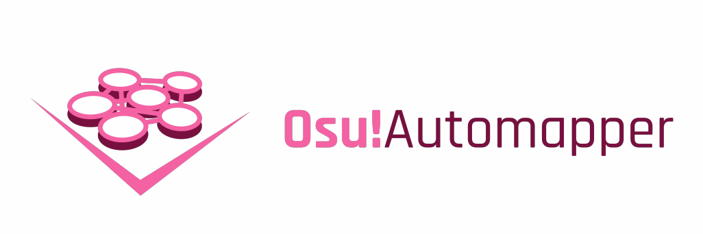

<style><!--If you can see this HTML comment in the rendered page, it means, you're probably seeing this file in GitHub. GitHub does not like the user to style their markdown file because it means it enables user to override with their style and probably doing javascript injection through that. I advise to use your markdown renderer, like Visual Studio Code by pressing CTRL+K V

I'm using inline style HTML on markdown for, obviously, styling purposes.--></style>

# **_Expert Systems 112 Portfolio Assignment - Project Docs_**

1313617014<br/>
2017 Computer Science of Jakarta State University<br/>
Muhammad Aufi Rayesa Frandhana<br/>
me@maufirf.me (business)<br/>
AufiRayesa_ilkom17@mahasiswa.unj.ac.id (academic)

---------------
---------------

On [`README.md`](README.md), I have introduced six projects:

1. [KRSBot5000](#KRSbot5000) **\[<a style="color:green">Deployed, Online</a>\]** ([Github Repo](https://github.com/parampaa2/krsbot5000))
2. [Bottlebot1904](#Bottlebot1904) **\[<a style="color:green">Deployed, Online</a>\]** ([Github Repo](https://github.com/parampaa2/bottlebot1904) | [Facebook Deployment](https://fb.me/bottlebot1904) | [Twitter Deployment](https://twitter.com/bottlebot1904))
3. [Bot](#Bot) **\[<a style="color:darkgreen">Deployment Paused</a>\]** ([Github Repo](https://github.com/parampaa2/bot) | [Facebook Deployment](https://fb.me/reallyabot) | [Twitter Deployment](https://twitter.com/really_a_bot) || **<a style="color:orange">\[POTENTIAL NSFW\]</a>**)
4. [Osu!AImapper](#Osu!AImapper) **\[<a style="color:pink">Development Paused</a>\]** ([Github Repo](https://github.com/parampaa2/Osu-AImapper))
5. [Bot tutorial (Indonesian)](#Bot_tutorial_(indonesian)) **\[<a style="color:yellow">In development</a>\]** ([Github Pages](http://maufirf.me/python-bot-quick-guide-id/) || **<a style="color:red">\[NSFW\]</a>**)
6. [Twitterfessbot](#Twitterfessbot) **\[<a style="color:green">Deployed, Online</a>\]** ([Facebook Deployment](https://fb.me/twitterfessbot) || **<a style="color:orange">\[POTENTIAL NSFW\]</a>**)

I will start from Osu!AImapper, as it is the most complex project and worth to be documented. Followed by the bots, then the bot tutorial.

## Osu!AImapper



_<sup>Osu!AImapper logo</sup>_

### Motives & Background

_Taken from [`README.md`](README.md):_
> This is the second most ambitious and largest in scale solo project I ever started. The premise behind this project was I was too bored completing all my favorite maps from my favorite mapper in [Osu!](https://osu.ppy.sh). I have several songs that I really want to play. The catch was it was either made by other people than my favorite mapper, or it's just not there at all. Every single mappers on Osu! community has their own unique perks, that is what differs them from each other. _What if there is a way to reproduce the style of a mapper to a new song?_

### Project Duration

5 Months of active development since the first development (February 2019) until the project pause in the middle of 2019.

### Source code structure

```
github.com/parampaa2/Osu-AImapper.git/ (root)
├ debug/
│ ├ __init__.py
│ ├ funcs.py
│ ├ test_dataCreator.py
│ └ timelinetesting.py
├ dump/
│ ├ test_mapset/
│ │ ├ Kurahashi Yoeko - Tomodachi no Uta (tutuhaha) [Light Insane].osu
│ │ ├ audio.mp3
│ │ └ audio.png
│ ├ Dan Salvato - Your Reality (Nozhomi) [Just You].osu
│ ├ RADWIMPS - Hikari (Haruto) [Mostrata].osu
│ ├ fhana - Sorairo Picture (Sotarks) [Haruto's Insane].osu
│ ├ nyanpass.mp3
│ ├ nyanpass.png
│ ├ nyanpass_1.png
│ ├ nyanpass_L.png
│ ├ nyanpassquantized.png
│ └ nyanpassrectified.png
├ framework/
│ ├ feedMaker/
│ │ ├ __init__.py
│ │ ├ dataCreator.py
│ │ ├ nnInput.py
│ │ ├ nnOutput.pu
│ │ └ toki.mp3 
│ ├ __init__.py
│ └ basic.py
├ io_custom/
│ ├ __init__.py
│ ├ consoleSetting.py
│ └ mapRead.py
├ util/
│ ├ Beatmap.py
│ ├ Difficulty.py
│ ├ HitObject.py
│ ├ TimingPoint.py
│ └ __init__.py
├ .gitignore
└ README.md
```

I have to point out if it was not clear enough that this project does not have starting point yet, as I only have completed the basic helper modules that is used by being imported. It has been told in [`README.md`](README.md). I have to apologize for the naming convention, python was kind of new to me that time.

Alphabetically, these are the explanations of the structure:

- `debug/` folder contains the functions to test and debug the current build of the helper modules
- `dump/` is the folder that I usually put sample files to be processed. The subfolder `test_mapset/` is the folder specifically designated to take files to process from by default. I forgot why i didn't put this to `.gitignore`, but I think it was because to show samples.
- `framework/` folder contains the framework program that will be used in specific proposal. It's also treated as one big module that contains all framework so everything can be accessed either from one import or specific `from` imports.
    - `feedMaker/` module helps to process the pre-processed data to neural network input format, cleaning the data, and return the output form to the post-processed form.
    - `basic.py` is the module that contains helper functions
- `io_custom/` is the I/O module made specifically for this project aside the python's original I/O modules. It includes but not limited to customizing the console output size (especially when debugging using ipython) and configuring the file import/export configuration.
- `util/` is the module that contains all the classes and functions that is used to turn Osu! items that is stated in `.osu` files into a pythonic form. Currently supported classes and modules are:
    - Beatmaps
    - Difficulties, which falls as the child of beatmaps
    - Hit objects, which falls as the child of beatmaps (will be revised to difficulties, because a map can have multiple difficulties), that generalizes its descendants:
        - Circles
        - Sliders
        - Spinners
    - Timing points, which falls as the child of beatmaps (ditto).

### Class and Function diagram

My project uses both OOP and functional programming. Most of the OOP are under the `util/` module, which is able to be summarized using class diagram:


_<sup>Osu!Aimapper class diagram</sup>_

while the rest of them, may be defined using tables. However, since I'm using python, stating the access level is quite have no use, and I'm not using no-tamper variables anyway (i.e. `_some_vars`). Instead, i'll add columns to describe basic use of the functions. Note that `debug/` will not be elaborated as it is only a modified version of `io_custom/mapRead.py` (`debug/funcs.py` and `debug/timelinertesting.py`) and a pre-typed debug for `framework/feedmaker/` module (`debug/test_dataCreator.py`).

- `framework/feedMaker/dataCreator.py`
    |Function|Parameter|Return|Description|
    |-|-|-|-|
    |`create_dataset`|`songPath`:`str`<br/>`beatmapPath`:`str`<br/>`makeCSV`:`bool`=`False`<br/>`CSVname`:`str`=`None`|`tuple(numpy.ndarray,numpy.ndarray),`<br/>`tuple(numpy.ndarray,numpy.ndarray)`|Creates a dataset pair of input and output for the neural net in two forms: full and spliced/scaled down.|
- `framework/feedMaker/nnInput.py`
    |Function|Parameter|Return|Description|
    |-|-|-|-|
    |`createSpectrogramImage`|`songPath`:`str`<br/>`songDuration`:`int`<br/>`picHeight`:`int`=`256`<br/>`bw`:`bool`z=`True`|`numpy.ndarray`|Using FFMPEG, creates spectrogram image from the specified song path.|
    |`get_duration_ms`|`songPath`:`str`|`int`|Returns the milisecond duration of the song passed as parameter.|
    |`spectrogramSplicer`|`spectrogram`:`numpy.ndarray`<br/>`interval`:`int`<br/>`contexted`:`int`=`0`<br/>`exportSplices`:`bool`=`False`|`list<numpy.ndarray>`|Splits the spectrogram into sliding windows with a really slow algorithm instead of using numpy's stride tricks.|
    |`heatColorsetQuantizer`|`R`:`int`<br/>`G`:`int`<br/>`B`:`int`|`int`|Converts an RGB color from the heat colormap (contextually from the FFMPEG spectrogram export) to grayscale, because there is no single parameter in FFMPEG to make it return a grayscale image.|
- `framework/feedMaker/nnOutput.py`
    |Function|Parameter|Return|Description|
    |-|-|-|-|
    |`timeliner_std`|`beatmap`:`Beatmap`|`numpy.ndarray`|Creates a detailed timeline with the form of boolean `numpy.ndarray` with shape of (maximum duration, 3) with the y axis represents an object type, respectively: circles, sliders, spinners, in which are the data type needed for the output layer. Also useful for debugging.|
    |`timelineSplicer`|`timeline`:`numpy.ndarray`<br/>`interval`:`int`|`numpy.ndarray`|Scale down the timeline on temporal resolition defined by the `interval` parameter.|
- `framework/basic.py`
    |Function|Parameter|Return|Description|
    |-|-|-|-|
    |`list_rindex`|`li`:`list`<br/>`x`:`int`|`int`|basically `list.index()`, but from right.|
    |`np_max_elementwise`|`a`:`numpy.ndarray`<br/>`b`:`numpy.ndarray`|`numpy.ndarray`|Basically a ridiculous reinventing the wheel attempt on elementwise `numpy.max()`.|
- `io_custom/consoleSetting.py`
    |Function|Parameter|Return|Description|
    |-|-|-|-|
    |`maximizeNumpyPrint`|`shrinkScale`:`int`=`1`|`None`|Maximize the console debug output width to the current window width|
- `io_custom/mapRead.py`
    |Function|Parameter|Return|Description|
    |-|-|-|-|
    |`readObjects`|`filepath`:`str`=`'dump/Dan Salvato - Your Reality (Nozhomi) [Just You].osu'`,<br/>`grouped`:`bool`=`False`<br/>`returnAsBeatmap`:`bool`=`False`|`str`,<br/>`Difficulty`,<br/>`list<TimingPoint>`<br/>`list<HitObject>`<br/>OR<br/>`Beatmap`|Reads the beatmap file and convert it into the framework utility classes, so it is usable in this program and can be interacted using pythonic ways.|
    |`printObjects`|`filePath`:`str`=`'dump/Dan Salvato - Your Reality (Nozhomi) [Just You].osu'`,<br/>`parentMap`:`Beatmap`=`None`|`None`|Simulates a beatmap object in real time, following the smallest splice interval (temporal resolution), by printing it on console. Will also print the statistics of the hit objects. NOTE: the smaller the interval, your processor may bottleneck the realtimeness even more.|

### Statistics

_Including docstrings_

```
github.com/parampaa2/Osu-AImapper.git/ (root)
├ debug/
│ ├ __init__.py               0
│ ├ funcs.py                 87
│ ├ test_dataCreator.py      13
│ └ timelinetesting.py       13
├ framework/
│ ├ feedMaker/
│ │ ├ __init__.py             3
│ │ ├ dataCreator.py         29
│ │ ├ nnInput.py            106
│ │ └ nnOutput.py            22
│ ├ __init__.py               0
│ └ basic.py                  8
├ io_custom/
│ ├ __init__.py               0
│ ├ consoleSetting.py         8
│ └ mapRead.py              124
├ util/
│ ├ Beatmap.py               16
│ ├ Difficulty.py            92
│ ├ HitObject.py            503
│ ├ TimingPoint.py          155
│ └ __init__.py               0
├ .gitignore                 10
└ README.md                  16 (1640 characters)
```
Total from 20 files: 1205 lines written.

## Bottlebot1904


_<sup>Bottlebot1904 banner</sup>_

### Motives & Background

This bot's creation history is heavily influenced by:

- Youtuber [Michael Reeves](https://www.youtube.com/channel/UCtHaxi4GTYDpJgMSGy7AeSw), for creating chaotic bots for his chaotic videos so that I was inspired to actually start creating something fun and I love.
- [Pimp My Gun Bot 1911](https://fb.me/pimpmygunbot1911), for creating a funny bot that fuses all types of guns and give it a random name (that gave me the idea of mixing bottles)
- One of our lecturer give me a quite severe anxiety attacks just by remembering that he exists which further dragging me to depression, my parents are not helping, and I got no money to go for a therapy, so I think I need to get away with life a little the other way by running away from my responsibilities.
- I don't have portfolios for my computer science career and that's bad
- I want to entertain every single people. That's quite an utopian life goal that I discarded a few months ago because it was unrealistic.

### Project Duration

_Taken from [README.md](README.MD):_
> The development of this bot is surprisingly fast and fascinating. This was born in one of the computer lab in Jakarta State University two day prior to deployment. It was later perfected at home.

### Source code structure

```
github.com/parampaa2/bottlebot1904.git
│   .gitignore
│   bot.py
│   bottle.py
│   PATH.json
│   Procfile_DEACTIVE
│   README.md
│   requirements.txt
│   server.py
│
└───db
    ├───img
    │       
   ... 41 .jpg files ommitted
    │       
    │
    └───json
        │   catalog.json
        │
        └───cutinfo
              ... 41 .json files ommitted
```

I had no specific structure since this bot is simple. I also have a little bit of static database structure on `db/` folder that has a pair of a `.jpg` images and its `.json` cutting positional data. `catalog.json` basically contains the information of what bottles are available to use in the static database.

The starting point of this project is `bot.py`. It automatically hosts a server in the current machine just by executing
```bash
$ python bot.py
```

### Class and Function diagram

There is not much object-oriented programming implemented other than the `Bottle` class, so most of them are describeable only just by the table I defined previously.

`Bottle` class:

|`Bottle`|
|-|
|`name`:`str`<br/>`cuts`:`list<int>`<br/>`parts`:`dict<str,[str||list<int>]>`<br/>`image`:`PIL.Image`|
|`get_image_parts`():`list<tuple(PIL.Image,tuple(str,str),tuple(tuple(int,int),tuple(int,int)))>`<br/>`analysis_image`():`PIL.Image`|


- `bot.py`\
    _there's no functions here, just a direct script_
- `bottle.py`
    |Function|Parameter|Return|Description|
    |-|-|-|-|
    |`get_other_axis`|`x`:`int`<br/>`xrate`:`int`<br/>`yrate`:`int`|`int`|Returns the other axis' value given by the first axis' value and the aspect ratio for first and second axis. Used for scaling.|
    |`makeline`|`xs`:`int`<br/>`ys`:`int`<br/>`xd`:`int`<br/>`yd`:`int`<br/>|`list<int>`,<br/>`list<int>`|Returns all x and y coordinate pair that makes a line from source coordinate pair to destination coordinate pair.|
    |`makesquare`|`x0`:`int`<br/>`y0`:`int`<br/>`x1`:`int`<br/>`y1`:`int`<br/>|`list<int>`,<br/>`list<int>`|Returns all x and y coordinate pairs that makes a square originating from source coordinate pair to destination coordinate pair.|
    |`define_path_vars`|_none_|`str`,`str`,`str`,<br/>`str`,`str`|Returns all required path strings needed to locate database and file dumping directory based on `PATH.json`.|
    |`get_bottle_image`|`name`:`str`|`PIL.Image`|Get an image of a bottle by the file name without the extension.|
    |`get_bottle_settings`|`name`:`str`|`list[list<int>,dict<str,[str||list<int>]>]`|Get a cutting points data of a bottle by the file name without the extension.|
    |`init_bottles`|`names`|`list<Bottle>`|Get all `Bottle` instances whose names are listed in the input parameter. Usable to make a post out of seasonal or thematic bottles. Sets the global variable for `bottles`.|
    |`init_bottles_from_catalogue`|_none_|`list<Bottle>`|Get all `Bottle` instances whose names are listed in the `db/catalogue.json`. Sets the global variable for `bottles`.|
    |`part_classify`|`bottles_data_structure`:`list<tuple(PIL.Image,tuple(str,str),tuple(tuple(int,int),tuple(int,int)))>`|`tuple<list<tuple(PIL.Image,tuple(str,str),tuple(tuple(int,int),tuple(int,int)))>>`|Separates the imported bottles by caps, bottoms, and the rest of them as mids. Sets the global variable for `caps`, `bottoms`, and `mids`.|
    |`bottle_append_two`|`parts`:`list<list[PIL.Image,tuple(str,str),tuple(tuple(int,int),tuple(int,int))]>`|`list[PIL.Image,tuple(str,str),tuple(tuple(int,int),tuple(int,int))]`|Concatenate two parts **and only two parts** of a bottle.|
    |`bottle_append`|`parts`:`list<list[PIL.Image,tuple(str,str),tuple(tuple(int,int),tuple(int,int))]>`|`list[PIL.Image,tuple(str,str),tuple(tuple(int,int),tuple(int,int))]`|Concatenate multiple parts of a bottle, implementing `bottle_append_two`.|
    |`flip`|`part`:`list[PIL.Image,tuple(str,str),tuple(tuple(int,int),tuple(int,int))]`|`list[PIL.Image,tuple(str,str),tuple(tuple(int,int),tuple(int,int))]`|Flips the part upside-down|
    |`fit_square`|`image`:`Image`<br/>`sizex`:`int`=`1000`<br/>`sizey`:`int`=`1000`<br/>`marginx`:`int`=`100`<br/>`marginy`:`int`=`100`<br/>`padx`:`int`=`0`<br/>`pady`:`int`=`0`<br/>`produce_mask`:`bool`=`False`|`PIL.Image`|Fits an image into a preset canvas, so the viewers may see a consisten image size in their screens.|
    |`random_pick_parts`|`n`:`int`=`None`<br/>`n_min`:`int`=`2`<br/>`n_max`:`int`=`6`<br/>`flip_enabled`:`int`=`1`|`list<list[PIL.Image,tuple(str,str),tuple(tuple(int,int),tuple(int,int))]>`|Picks random parts of bottles.|
    |`super_random_bottle`|_none_|`tuple(list[PIL.Image,tuple(str,str),tuple(tuple(int,int),tuple(int,int))],list<list[PIL.Image,tuple(str,str),tuple(tuple(int,int),tuple(int,int))]>)`|Generates a random bottle, returns `tuple` of a bottle part as a whole and its as individual parts in a `list`.|
    |`get_ingredients_as_str`|`picks`:`list<list[PIL.Image,tuple(str,str),tuple(tuple(int,int),tuple(int,int))]>`|`str`|Gets the ingredients for given picked bottle.|
    |`get_random_volume`|`bottleimg`:`PIL.Image`|`int`,`str`|Gets the volume of the bottle based on the image size if given the image, otherwise randomized. Also the volumetric measurement units string.|

### Statistics

_Docstrings included_

```
github.com/parampaa2/bottlebot1904.git
│   .gitignore            7
│   bot.py               63
│   bottle.py           317
│   PATH.json            13
│   Procfile              1   
│   README.md            38 (3582 characters)
│   requirements.txt      4
│   server.py            71
```

Total from 8 files: 514 lines written.

## Bot

### Motives & Background

_copied from [maufirf.me/Bottlemin-Bots](http://maufirf.me/Bottlemin-Bots):_
> The main inspiration of Bot is the Facebook page [THEY](https://www.facebook.com/profile.php?id=1149863928385827&ref=br_rs) and its group ([THEY (how do i tag myself?)](https://www.facebook.com/groups/theytheytheytheythey/)) for their vaguely meta contents. The motivation that pushes this bot to its existence is the running joke of _[some of the facebook 'bots' is actually not bots](https://www.facebook.com/groups/botappreciationsociety/permalink/533509313925543/)_ in [Bot Appreciation Society Facebook group](https://www.facebook.com/groups/botappreciationsociety). Since the ban of two Facebook pages that were pretending to be bots, people just raise suspicion whether any bots are actually bots or otherwise ironically. So, this more like a sarcastic bot that is pretending so hard being a bot by simply being an actual bot. If you tried to indulge the contents unironically, what you find is just a bot that posts incomplete sentences following a series of patterns.

### Project Duration

_Taken from [README.md](README.md):_
>This bot only took just an hour of development. The Facebook page was born on 25th February, 2020, but it was actually deployed two days later. Within five days, the page has gained 1000 likes. Currently, it has 2000 likes.

### Source code structure

```
github.com/parampaa2/bot.git
│   .gitattributes
│   .gitignore
│   bot.py
│   emojis.json
│   gdrive_helper.py
│   README.md
│   requirements.txt
│   stringer.py
│   templates.json
```

Similar to previous one, no special treatment.

### Class and Function diagram

There is only one class made here in `stringer.py`:

| `Stringer_Ctrl` |
|-|
|`raw_templates`:`list<list[str,int,int]>`<br/>`formats`:`list<str>`<br/>`weights`:`list<int>`<br/>`vars`:`list<int>`<br/>`custom_words`:`list<str>`|
|`__init__`():`Stringer_Ctrl`<br/>`pick_pattern`():`str`,`int`<br/>`generate`(`base`:`tuple(str,int)`):`str`<br/>`authenticate`():`None`|

while the rest are functional programming, which also has only one function. The `bot.py` is similar like before, just top level scripts.

- `gdrive_helper.py`
    |Function|Parameter|Return|Description|
    |-|-|-|-|
    |`get_all_values`|_none_|`list<str>`|Gets all user input from the google spreadsheet.

### Statistics

```
github.com/parampaa2/bot.git
│   .gitignore            9(personally added)
│   bot.py               49
│   emojis.json           6
│   gdrive_helper.py     24
│   README.md             2 (21 characters)
│   requirements.txt      6
│   stringer.py          24
│   templates.json       27
```
Total from 8 files: 147 lines written

## KRSBot5000

### Motives & Background

_Taken from [README.m](README.md):_
> This bot was made as inside joke originated from [BEM Shitposting Indonesia (BEMSHI)](https://web.facebook.com/bemshitposting/) community, which consisted of people that revolves around Facebook pages of each universities' shitposting representatives. Prior to the deployment date, this bot has no affiliation with previously said group, BAS.

### Project Duration

_Taken from [README.m](README.md):_
> The development of this bot starts around November 26th, 2018. It is working on the offline part, but not yet ready to be used for online purposes to that date. Instead, It's deployed on May 25th, 2019. To this day, I'm aware this bot is used on at least three Discord servers.

### Source code structure

```
github.com/parampaa2/krsbot5000.git
│   .gitignore
│   bot.py
│   commands.json
│   core.py
│   courses.json
│   debug.py
│   LICENSE
│   Procfile
│   README.md
│   regextest.py
│   requirements.txt
│
└───framework
        card.py
        dbprocess.py
        instance.py
        meta_attrib.py
        __init__.py
```

Not much code folder aggregation, I only made a framework folder that contains all the utility i need in order to create a KRS.

### Class and Function diagram

KRSBot5000 starts on the launch of `bot.py`. As simple as
```bash
$ python bot.py
```
There are few classes, most of them clustered on the `framework/` folder, but some of them are also on the `core.py`.


_<sup>KRSBot5000 framework utility class diagram</sup>_

|**`Core_C(enum.Enum)`**|
|-|
|`GENERAL_CREDITS`:`list<int>`<br/>`SPARSE_MULTIPLER`:`list<int>`<br/>`GREED`:`tuple(str,int)`<br/>`NORMAL`:`tuple(str,int)`<br/>`SPARSE`:`tuple(str,int)`|
||

|**`Core`**|
|-|
|`dbproc`:`DBProcess`<br/>`wrap_instance`:`list<University>`,`list<Faculty>`,`list<Major>`,`list<Course>`|
|`__init__`(`json_path`:`str`=`courses.json`):`Core`<br/>`get_course_list_by_sem_credits`(`sem_credits`:`int`,`slot_behave`:`Core_C`=`Core_C.NORMAL`):`list<Course>`<br/>`get_random_study_plan`(`sem_credits`:`int`=`1`,`university`:`University`=`None`,`faculty`:`Faculty`=`None`,`major`:`Major`=`None`,`semester`:`int`=`None`,`random_type`:`int`=`0`)|

While the rest of them are functional programming. Although this bot is an active responding bot that can response in real time. Therefore, this bot is active 24/7 (unlike other bots that only online at least 24 seconds per day) and needs proper asynchronous functions to respond with. `Discord.py` library has provided the override-able async functions.

- `bot.py`
    |Function|Parameter|Return|Description|
    |-|-|-|-|
    |`@discord.Client.event async on_ready`|_none_|`None`|Asynchronous server protocol to response the bot being online after a reply from the Discord API.|
    |`@discord.Client.event async on_message`|`message`:`discord.Message`|`None`|Asynchronous server protocol to response to webhook message packets which the bot has the privilege/permission to read.|
    |`@discord.Client.event async on_ready`|`channel`:`discord.abc.Messageable`<br/>`user`:Union[`discord.User`,`discord.Member`]<br/>`when`:`datetime.datetime`|`None`|Asynchronous server protocol to response typing users on channels which the bot has the privilege/permission to read|

### Statistics

```
github.com/parampaa2/krsbot5000.git
│   .gitignore            3
│   bot.py              185
│   commands.json        29
│   core.py             120
│   courses.json        460
│   debug.py              7
│   LICENSE               0 (21 written by MIT)
│   Procfile              1
│   README.md           107 (3876 characters)
│   regextest.py         21
│   requirements.txt      2
│
└───framework
        card.py          63
        dbprocess.py    136
        instance.py     172
        meta_attrib.py  111
        __init__.py       0
```

Total from 16 files: 1417 lines written

## Twitterfessbot

### Motives & Background

_Taken from [README.md](README.md):_
>Twitterfessbot, or TFB for short, is a [Facebook bot](https://fb.me/twitterfessbot) that posts random tweets from randomly selected anonymous confession accounts that is generally localized to Indonesian region. Born May 12th, 2020, amidst the COVID-19 pandemic in a ominous chat group. The bot was a mere joke to the "bot idea" meme which flourishes on [The Bot Appreciation Society](https://web.facebook.com/groups/botappreciationsociety), and also a satire to those fess accounts. This bot is under the supervision of [Bottlemin](https://maufirf.me/Bottlemin-Bots).

### Project Duration

The development until its first deployment only took less than a day, likely to be around an hour.

### Source code structure

***THE REPOSITORY IS PRIVATE, SOME OF THE CONTENTS MAY BE OMMITTED***

Detailed information regarding the structure is currently classified. It will be open source soon after it is ready. I want to make the bot as one of the good, clean, simple example of the bot tutorial implementation.

### Class and Function diagram

Ditto.

### Statistics

Total 208 lines written. Detailed information has been ommitted.

## Bot Tutorial (Indonesia)

### Motives & Background

_Taken from [README.md](README.md):_
> The background of this project was the lack of clear and thorough tutorials of the subject in the internet. In the contrast, there is a whole lot more than just sufficient amount of resources and helping communities in english. There are some tutorials too, but most of them involves using ready-to-use GUI web-based API and no programming needed. I'm not targeting just for the people to be able to make bots, I am aiming to give them a full freedom (and responsibilities) in developing their own bot.
>
> In fact, one of the the bot i made that I will explain after this uses the boilerplate code i made for this tutorial as a proof of concept. It has only a few lines of codes, which I hope will less discouraging the readers, and instead motivates them to make one because it is not that hard. It is hard, of course, but it's not like people are going to die making this harmless bots.

### Project Duration

_Taken from [README.md](README.md):_
> This project took awhile, I started writing for two days and then i paused when reaching the checkpoint. I am still continuing to writing it, but I need a computer replacement first, because I'm not doing it again in internet cafe amidst the pandemic.

### Source code structure

Most of the repositories only consist of documentations, which is full of tutorial. Initially, I wanted to use Github wiki, but I wanted to use github pages, so yeah, i passed that decision.

People who uses this tutorial can start cloning the repository and go to `projects/` folder and choose the project they wish to start. There's only one available for now, though, which is `example/`.

On `example/` project, users can simply launch a bot by either choosing their preferred launch scripts:
```bash
$ python bot_discord.py
```
```bash
$ python bot_facebook.py
```
```bash
$ python bot_twitter.py
```

The repository is not private, but visiting the repository in normal ways is not intentional. Users are encouraged to only open the repository when they reached a checkpoint in tutorial, in which the link is available.
```
...
│   .gitignore
│   LICENSE
│   README.md
│   _config.yml
│
├───assets
│   └───img
│           ... 25 .png images ommitted
│
└───projects
    └───example
            .env
            .gitignore
            bot_discord.py
            bot_facebook.py
            bot_twitter.py
            key_loader.py
            requirements.txt
```

### Class and Function diagram

Enums from `key_loader.py`:

|**`GENERAL_ACCESS_TOKEN(enum.Enum)`**|
|-|
|`DISCORD`:`str`<br/>`TWITTER`:`str`<br/>`FACEBOOK`:`str`|
||

|**`TWITTER_KEYS(enum.Enum)`**|
|-|
|`API_KEY`:`str`<br/>`API_SECRET`:`str`<br/>`ACCESS_TOKEN`:`str`<br/>`ACCESS_TOKEN_SECRET`:`str`|

The rest is functional programming. `bot_facebook.py` and `bot_twitter` is a top level script, while `bot_discord.py` is similar like usual discord bots that uses asynchronous functions:

- `bot.py`
    |Function|Parameter|Return|Description|
    |-|-|-|-|
    |`@discord.Client.event async on_ready`|_none_|`None`|Asynchronous server protocol to response the bot being online after a reply from the Discord API.|
    |`@discord.Client.event async on_message`|`message`:`discord.Message`|`None`|Asynchronous server protocol to response to webhook message packets which the bot has the privilege/permission to read.|

### Statistics

```
...
│   .gitignore                    3
│   README.md                   494 (44829 characters)
│  
└───projects
    └───example
            .env                  8
            .gitignore            5
            bot_discord.py       25
            bot_facebook.py      10
            bot_twitter.py       10
            key_loader.py        16
            requirements.txt      5
```

Total from 9 files: 576 lines written