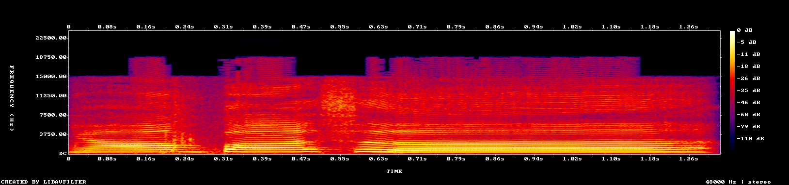

<style><!--If you can see this HTML comment in the rendered page, it means, you're probably seeing this file in GitHub. GitHub does not like the user to style their markdown file because it means it enables user to override with their style and probably doing javascript injection through that. I advise to use your markdown renderer, like Visual Studio Code by pressing CTRL+K V

I'm using inline style HTML on markdown for, obviously, styling purposes.--></style>

# **_Expert Systems 112 Portfolio Assignment - Insight_**

1313617014<br/>
2017 Computer Science of Jakarta State University<br/>
Muhammad Aufi Rayesa Frandhana<br/>
me@maufirf.me (business)<br/>
AufiRayesa_ilkom17@mahasiswa.unj.ac.id (academic)

---------------
---------------

## An understatement

Saying that I learned a lot from my projects is an understatement. I learned quite a lot of stuffs when doing those projects. The projects I've been doing is not without flaws and mistake, but sometimes they helped me to get further away from them. I've learned how to use asynchronous functions, I know how to do a quite new vision on image processing, learning what does an API mean, cybersecurity, and so much. I even know how to collaborate with other people (even though the currently featured projects are mostly solo projects).

## Funny accidents

I have done **a lot** of mistakes during development of some of my projects.

#### Access token safety

KRSBot5000 had one of its most damaging tragedy once. Since KRSBot5000 is my first bot, I keep forgetting the notes that I should be careful when storing access tokens. I had to learn it the hard way by seeing my Discord server being hacked by other people because I did put my access token on public. Hosting at Heroku means you need to either connect to their git or just connect your repository to them. I was not aware of what an `.env` is and instead used a `.json` file to store access token. I was confused on how to keep the bot know its access token while not exposing it. But the me that is not careful, uploads `auth.json` anyways. I also not aware what `.gitignore` offers to me.

This is the not the first time I know for a bot scanning all github repositories, but this is the first time I know such bot exist with an intent to hijack a Discord which is a really specific intent. They scanned my repository and found my access token. My bot on my Discord server has a semi-admin privileges, so it can delete chat channels, rename them, change other's nickname, delete emoji and chat channels, everything. Luckily, the bot is only limited to some channels, so my discord server didn't end up in total destruction. The damage caused is still managable, but the lost things are lost.

Since then, I've learned a lot about how to keep our access token secure. I've started to learn how `.env` can store environment variables and importing them into python is as easy as
```python
from dotenv import load_dotenv
load_dotenv()
```
and everything is done. What I found fascinating, `load_dotenv()` does not require the `.env` file to exist in the directory so it means I can safely not to upload the access tokens by including it in `.gitignore`. And to keep the bot know the access token, I used the cloud machine's environment variable configuration.

I Also have discussed with some of my friends in Ilkom UNJ, which two of them starts making bots after I done mine. I had a huge discussion about that with one of them and he didn't do any accidents like mine. However, the other one was having a near miss with the blunder. He was lucky as he is using `.env` to store variables instead of like old me using `auth.json`, Discord scans for the repository and warned the developer via his server and Github mails him via email about that. He immediately deleted the whole repository even though I have already advised him just to delete the sensitive file, but he already did that anyways and it's not a problem for him, so, okay.

#### User input moderation

I think i've already elaborated this on [`README.md`](README.md#Bot).

Always filter your user input if you think it's going to endanger your project.

Had to learn it the hard way again.

#### Being non-formal developers in a formal environment

Using a platform, especially developing a third-party programs that will involve using the platform means you have to agree to its terms and conditions and abide their privacy policy. Sometimes it is super annoying especially when you only just want to do small experiment, like as simple as posting an image to Facebook using its Graph API. It sounds a simple execution, but in order to do that, we need a lot of effort of proving to that platform if we're eligible to do so.

Facebook is the biggest riddance among all the other platforms. That is understandable as that platform has went through a lot of tragedies like the Cambridge Analytica, so the TOS for our own privacy policy is strict and highly enforced. We are required to make our own privacy policy that is integrated to Facebook's as the requirement for us to be allowed to use the API. Actually, not limited to that; **we need a legit business paperwork in order to use the API**. That is too much for us that just wanted to automatically post a picture of a cat every hour. We are individual person, and not a business collective, we don't have those kind of things. Our creativity is being hindered.

But that does not mean we don't do anything about that.

I got my first access token from facebook by using the in-development privillege, which means the app i build on facebook can only be used when it is using my own account. If you ever see options like "login with Facebook", when you log in using that it means you are using someone's app. I don't need those, and I only need my account to post into my own Facebook page. I am surprised that I have no problem at posting using my own access token. However, to get a permanent access token is hard and I have to go to a day-full process in order to get around and obtain one. My friends on the BAS community quite despised my method as it is full of uncertainity, and will probably get my page shut down. None of us actually know what is inside, though. It's hard staying legal while being illegitimate.

That uncertainity made me use the [tool that BAS (specifically Max) has developed](https://maxbots.ddns.net/token) to get an access token permanently in under one minute. how that works is Max creates an app that is fully legal and legitimate under the name of _"BOT ACCESS TOKEN TOOL"_ (I am amazed how did he got away with that obvious name). That way, we log in into his app and get access tokens.

But playing like this does not mean Zucc didn't know anything.

I often got unknown 24h mute bans for every two or three day, both for my pages and my personal account. Last April, it happens a full month. It may seem like Zucc tries to punish us, although I never experienced that anymore and had to backup account so when one of my accounts are banned, I can still access my pages through the other.

Or perhaps Zucc actually didn't know anything because their ban algorithm sucks.

In contrast, Twitter and Discord are two platforms that embraces and supports the existence of bots. They provide thorough API and easier access. That made some of us moved to Twitter. I decided the other way: I expand. I also use Twitter to make bots. The bots are able to post in Facebook and tweet the same thing in Tiwtter simultaneously, synced. However, the only tradeoff is the audience and engagement type. Twitter are limited in Tweets (including retweets) and likes, while Facebook offer 6 different type of reactions, then a comment section, and share function. That can data is more valuable than Twitter for whatever future benefits can be harvested from.

It's like having another tet offensive, while you're the civilian instead of either soldier parties.

## One way to do another

When making Bottlebot1904, I know it will involve image processing and editing. I once questioned _how?_ Right now, I have learned that you can use PIL to import, or using Skimage, or even native python IO library. However, I often use PIL as it offers a range of transformation functions that is ready to be used and I don't even have to do it again. It also has numpy support, so I can always easily swtich transformation modes whether helped by the PIL functions, or i'll do it myself using numpy. It's flexible and I love it.
```python
from PIL import Image
import numpy as np
img = Image.open('path/to/image.jpg')
img_as_array = np.array(img)
img_reconverted = Image.fromarray(img_as_array)
```
There's also perhaps a lot of ways to get the input you want from an undesired input. For example, during the development of Osu!AImapper, I needed a software that can help me get a spectrogram from an audio file. I found out one of my favorite youtubers uses ARSS to convert it. But it's an outdated software and I spent my time doing some work around it though no good results. Then, I decided to look for alternatives and found FFMPEG. I didn't really get the results I want right away, like, I can't process the image when it has unnecessary parts like texts:

```cmd
ffmpeg -i nyanpass.mp3 -lavfi showspectrumpic=s=1344x256:mode=combined nyanpass.png
```



There is no parameter to suppress it, so I do it with `Image.crop` to crop it anyways and the result is not disappointing!


The next thing I do is converting it into grayscale. The problem is, it is using a color map. On the day of the development, I don't know I can just use parameter `color=channel` to make it grayscale because the docs was not clear enough, so I tried with my own algorithm to convert the colormap to grayscale. The result is terrible.

Loss of data:

Loss of fidelity:

Wrong range of grayscale:

Another wrong range of grayscale:


While just a few moments ago, I found out you can use the said parameter to get an almost-perfect spectrogram:

```cmd
ffmpeg -i nyanpass.mp3 -lavfi showspectrumpic=s=1344x256:mode=combined:color=channel nyanpass.png
```


I feel sick.

But yeah, there's a lot of way to do stuffs and you can definitely get what you want. With a cost of time and effort. _Does it even worth it?_